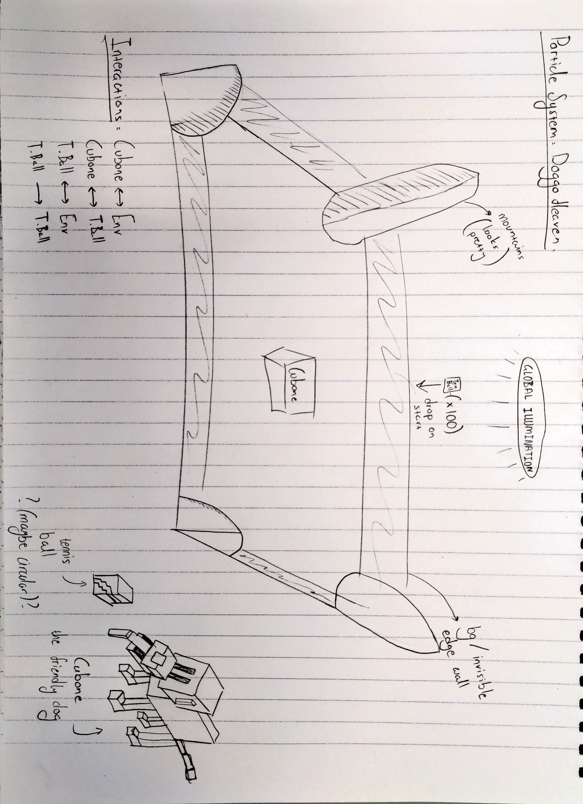
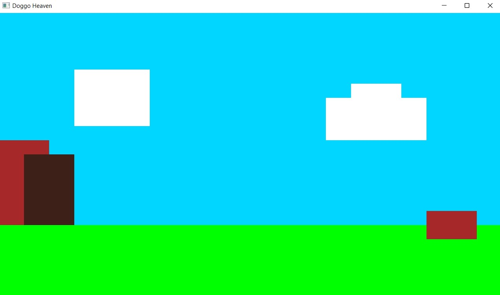
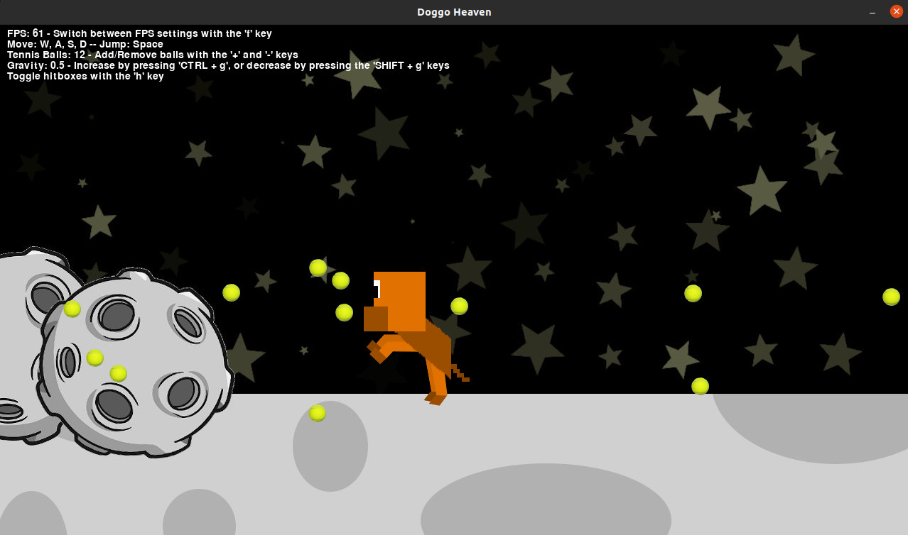

# Particle System: Doggo Heaven

A mini project particle system created for COMP37111 - Advanced Computer Graphics.

The idea behind the particle system is to create a dog heaven filled with bouncy tennis balls.

This README file will be updated along the way with illustrations, 3D mockups and a demo video.

Paper illustration: 
2D PyOpenGL illustration (before addition of `pygame`): 
2D PyGame illustration (with `pygame` alone -- updated): 

# Requirements

It's entirely optional but recommended that you use a virtual environment for python such as `pyenv` which can be used with `venv` and `virtualenv`, to avoid any dependency clashes with your global environment.

The project was done using Python 3.8.6 (this is due to 3.8.6 being the default version that comes with Ubuntu Linux at the time of writing), and the libraries which can be viewed and installed through the provided `requirements.txt` (or `requirements_dev.txt` for any optional libraries) file using:
```
# Installs both the required and optional libraries.
$ pip install -r requirements_dev.txt
```

# Usage

```
# Navigate to the root directory of this repository.
# Activate python virtual environment if applicable.
$ python doggo_heaven/main.py
```
